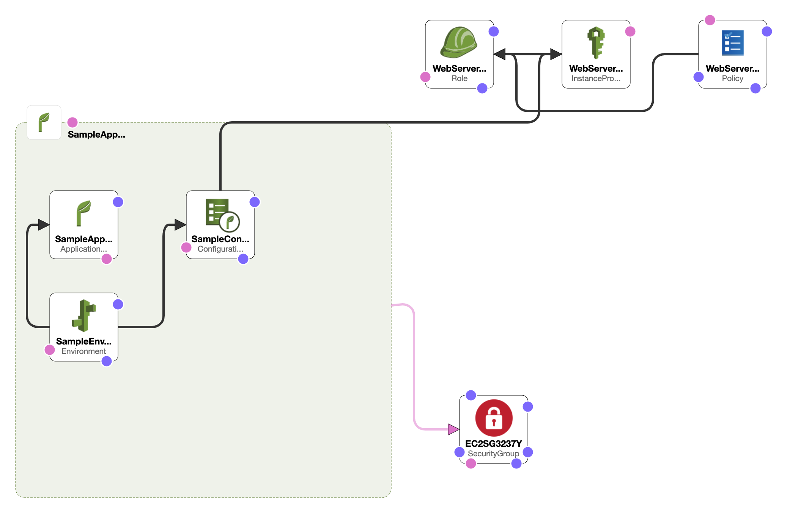

# Table of Contents
1. [overview](#overview)
2. [prerequisites](#prerequisites)
3. [initial-deploy](#initial-deploy)
4. [updating](#updating)

***

## overview

- very basic deployment
- example will deploy a sample nodejs hello world application ( https://github.com/GoogleCloudPlatform/nodejs-getting-started/tree/30d625750f542a03e9c239ac851560ac0def3080/1-hello-world ) 
- will have default auto-scaling of:
  - min:1 max:5 nodes
  - metric: NetworkOut, 50 lower, 500 upper breach limits

- can be tested using ab - Apache HTTP server benchmarking tool
  - ab -c 50 -n 50000 $URL
(exact configs might differ based on application used, just giving a very basic example)

this should confirm machines are scaling up/down.

## prerequisites

- s3-bucket `nodejs-elastic-beanstalk` to be present in the specified region (can be modified on the template/template.yml)
  - upload sources/google-nodejs.zip to that s3-bucket /
- export AWS_PROFILE AWS_REGION to your liking
- export STACK_NAME=your_preferred_stack_name
- export S3_BUCKET_CF_ARTIFACT=bucket_you_want_to_use_for_cloudformation_artifact_uploading (can just be same as nodejs-elastic-beanstalk)

***

## initial-deploy

- then with ./menu.sh

1) aws cloudformation package
2) aws cloudformation deploy
  this should ideally create the whole environment
3) aws elasticbeanstalk describe-environments to see the URL (a bit basic, but should work)
4) `optionally` aws cloudformation describe-stack-events to see cloudformation stack events
5) application logs are on cloudwatch

***

## updating

1) you got a new zip from developers?
2) upload the new zip to the bucket
3) adjust the S3Key on the template/template.yml (google-nodejs.zip)
4) re-package & re-deploy (should be creating a new version/seamless upgrade)
5) done

